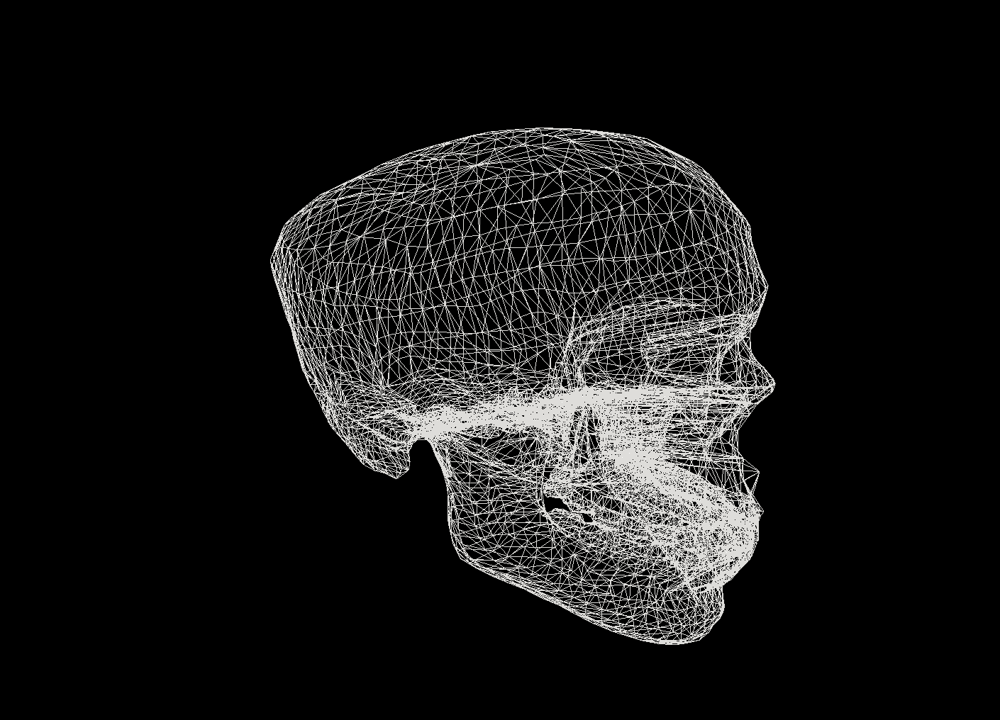
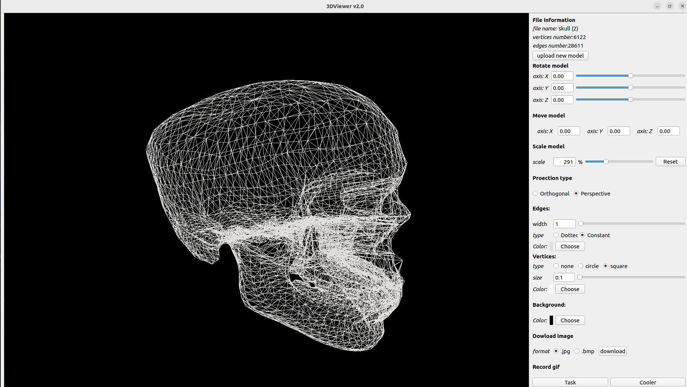

## 3DViewer 2.0

###  Приложение для просмотра 3D моделей в каркасном виде
Приложение загружает выбранную модель из файла формата obj
* Возможно перемещать модель как с помощью интерфейса, так и с помощью мыши
* Приложение имеет большие возможности для кастомизации:
    Выбор цвета фона
    Изменение размера и цвета вершин и ребер
    Изменение типа проекции
    *Настройки сохраняются при выходе из приложения*
    
* Установка

**Go to the src/s21_3DViewer_v2_0 folder and run make install to install the application**

